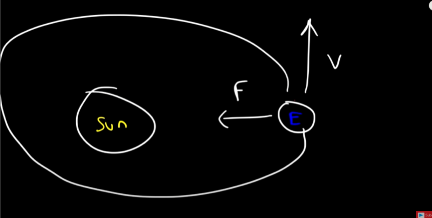
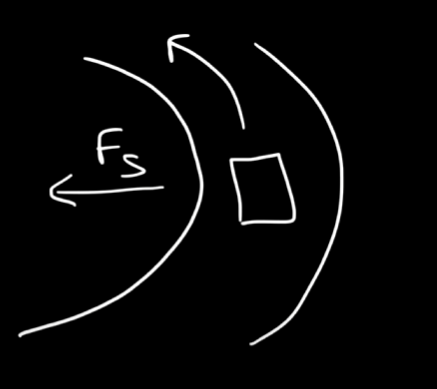

# Centripetal Force 
---
if the velocity vector is perpendicular to the force vector, then there will be a Centripetal force, this will cause **uniform circular motion**.

>The attention force provides the centripetal force on an object

The earth orbits the sun, what provided the centripetal force?
What keeps the Earth orbitting the Sun

The Force of gravity is the attention force, the velocity of earth is perpendicular to the attention  force, causing **uniform circular motion**
- Gravity keeps the earth in orbit around the sun through the centripetal force in orbit.

## How do car turns cause centripetal force
---
When a car turns the [static frictional](./friction_types/static.md) force is what is providing the centripetal force, **why?**because the static friction is perpendicular to the force vector

The Centripetal Force is tied to [Newton's 2nd Law](../newtons_laws/2nd_law.md)

You can find the Centripetal force by using the 2nd law to solve for the following: $F_c = MA_c$

You have Centripetal acceleration

This can be found by using the following formula $A_c = v^2/r$
$$
F_c= mass*v^2/r
$$

### Feeling the Force
---
1. If the mass or velocity increase you will have a stronger centripetal force, this is what happens when you make a sharp turn (tight/ small radius)
2. If you increase the radius you lose some of that centripetal force.
> You feel centripetal force when you make a sharp turn

double the mass, double the force.
double the speed, you get that force squared

### Source used for the video
---
[Chemistry tutor video used](https://www.youtube.com/watch?v=ZZx3mYNk2wg)

