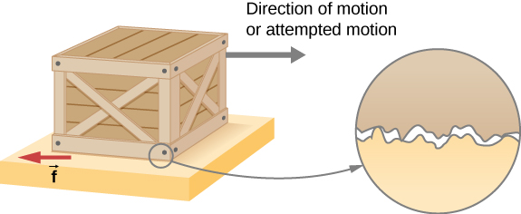

# Kinetic/ Dynamic Friction
---

Once motion has started, kinetic friction takes over. This is usually less than static friction.

**kinetic friction acts against the direction of motion**
the frictional force is dependent on many factors but is generally constant for a given set of conditions

if two systems are in contact & **moving** relative to one another, then that friction between them is kinetic

