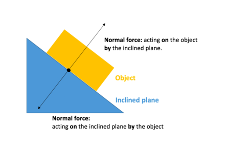

# Normal Force
---

## Reactive Force
normal force is a reactive force according to [Newtons Third Law](../newtons_laws/3rd_law.md)

when gravity pulls something towards it and it exerts a force on the surface there is an **equal and opposite reaction** according to the third law.
The normal force is always pointed perpendicular to the surface.

what this means is, that normal force moves perpindicular to the surface, **not just opposite of gravity**

## [Frictional Force](frictional.md)

Normal Force & Friction are **closely related** 
frictional force is directly proportional to normal force

